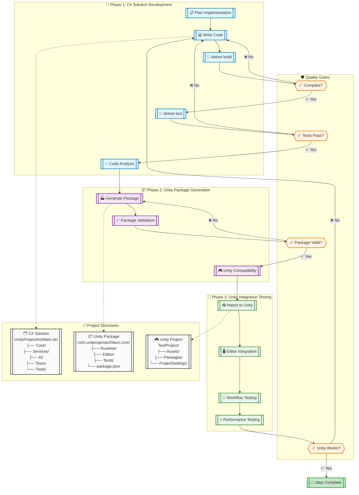
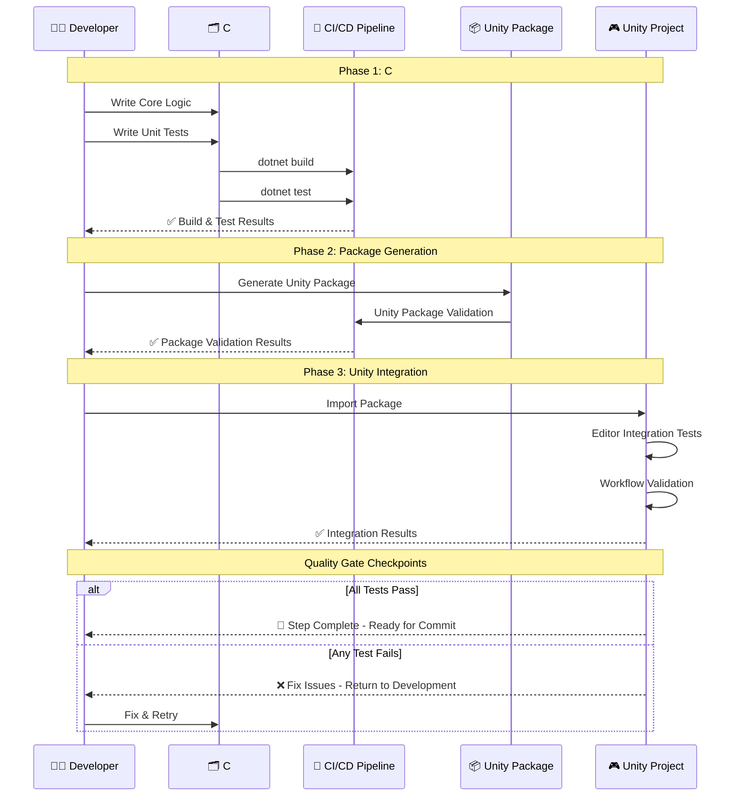
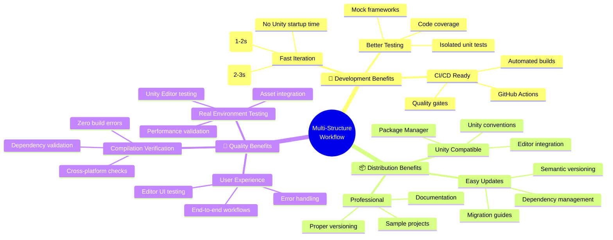
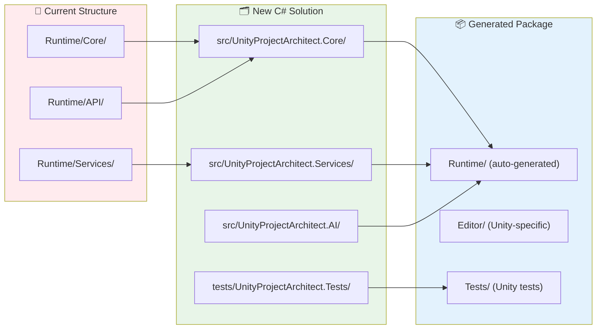
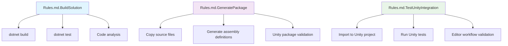

# Unity Project Architect - Multi-Structure Development Workflow

**Version:** 2.0  
**Date:** August 4, 2025  
**Purpose:** Comprehensive development workflow using C# solution, Unity package, and integration testing structures

---

## 🏗️ Multi-Structure Architecture Workflow

---

## 🔄 Enhanced Development Pipeline

---

## 📊 Workflow Benefits Analysis

---

## 🛠️ Implementation Strategy

### **Migration Plan: Package Structure → C# Solution**

### **New Rules.md Actions**

---

## ✅ Quality Gates Checklist

### **Phase 1: C# Solution** 
- [ ] ✅ Code compiles without errors (`dotnet build`)
- [ ] ✅ All unit tests pass (`dotnet test`)
- [ ] ✅ Code coverage meets threshold (80%+)
- [ ] ✅ Static analysis passes (no critical issues)
- [ ] ✅ Dependencies are properly managed

### **Phase 2: Unity Package**
- [ ] ✅ Package structure follows Unity conventions
- [ ] ✅ Assembly definitions are correct
- [ ] ✅ Unity Package Validation passes
- [ ] ✅ No Unity-specific compilation errors
- [ ] ✅ Package.json metadata is complete

### **Phase 3: Unity Integration**
- [ ] ✅ Package imports without errors
- [ ] ✅ Editor windows open and function
- [ ] ✅ Menu items are properly integrated
- [ ] ✅ Workflows execute end-to-end
- [ ] ✅ Performance meets requirements
- [ ] ✅ No console errors or warnings

---

**Next Steps:**
1. 🔄 **Restructure current code** to C# solution format
2. 🧪 **Implement proper unit testing** with compilation verification
3. 🏭 **Create package generation pipeline** from C# solution
4. 🎮 **Set up Unity integration project** for end-to-end testing

This multi-structure approach ensures **quality, testability, and maintainability** while maintaining Unity compatibility and professional distribution standards.