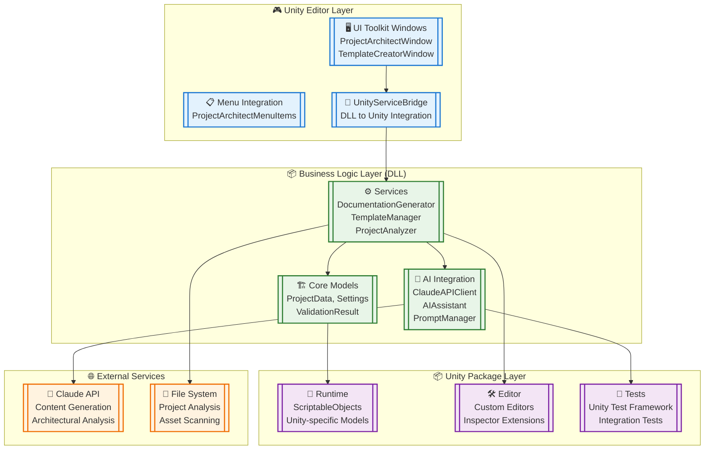
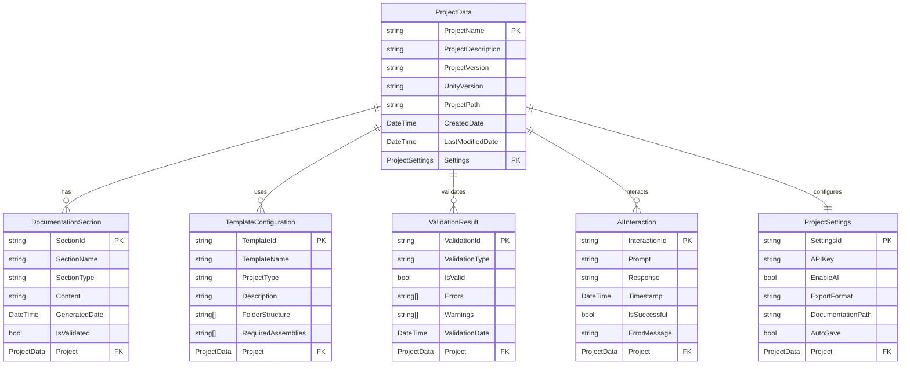

## Índice

0. [Ficha del proyecto](#0-ficha-del-proyecto)
1. [Descripción general del producto](#1-descripción-general-del-producto)
2. [Arquitectura del sistema](#2-arquitectura-del-sistema)
3. [Modelo de datos](#3-modelo-de-datos)
4. [Especificación de la API](#4-especificación-de-la-api)
5. [Historias de usuario](#5-historias-de-usuario)
6. [Tickets de trabajo](#6-tickets-de-trabajo)
7. [Pull requests](#7-pull-requests)

---

## 0. Ficha del proyecto

### **0.1. Tu nombre completo:**
David Camilo Gaitán Castro

### **0.2. Nombre del proyecto:**
Unity Project Architect

### **0.3. Descripción breve del proyecto:**
Unity Project Architect es un paquete de Unity Editor potenciado por IA que automatiza la generación de documentación de proyectos, creación de plantillas y gestión de flujos de trabajo de desarrollo. El paquete se integra perfectamente en el entorno de desarrollo de Unity, proporcionando a los desarrolladores herramientas inteligentes para mantener documentación completa de proyectos y estructuras de proyectos estandarizadas.

### **0.4. URL del proyecto:**
https://github.com/DK-milo/UnityProjectArchitect/tree/master

> Puede ser pública o privada, en cuyo caso deberás compartir los accesos de manera segura. Puedes enviarlos a [alvaro@lidr.co](mailto:alvaro@lidr.co) usando algún servicio como [onetimesecret](https://onetimesecret.com/).

### 0.5. URL o archivo comprimido del repositorio
[URL DEL REPOSITORIO AQUÍ]

> Puedes tenerlo alojado en público o en privado, en cuyo caso deberás compartir los accesos de manera segura. Puedes enviarlos a [alvaro@lidr.co](mailto:alvaro@lidr.co) usando algún servicio como [onetimesecret](https://onetimesecret.com/). También puedes compartir por correo un archivo zip con el contenido

---

## 1. Descripción general del producto

### **1.1. Objetivo:**

Unity Project Architect tiene como objetivo convertirse en la herramienta estándar para la documentación de proyectos Unity y la planificación arquitectónica, permitiendo a los desarrolladores mantener documentación de nivel profesional con un esfuerzo manual mínimo.

**Valor principal:**
- **Reducir el tiempo de documentación en un 80%** mediante generación automatizada
- **Organizar estructuras de proyectos** en equipos y proyectos
- **Mejorar la mantenibilidad del proyecto** mediante documentación completa
- **Acelerar la organización del proyecto** con plantillas de estructura inteligentes

### **1.2. Características y funcionalidades principales:**

#### **Generador de Documentación Automatizada**
- Generación automática de 6 secciones estándar de documentación
- Análisis inteligente de la estructura del proyecto
- Exportación en múltiples formatos (Markdown, PDF, Unity Assets)
- Integración con Claude API para contenido contextual

#### **Sistema de Plantillas Inteligentes**
- Plantillas predefinidas para tipos comunes de proyectos Unity
- Generación automática de estructura de carpetas basada en el tipo de proyecto
- Creación de archivos de definición de ensamblado con dependencias apropiadas
- Generación de escenas de muestra y scripts básicos

#### **Integración con IA**
- Integración con Claude API para sugerencias arquitectónicas
- Prompts especializados para cada sección de documentación
- Análisis de proyectos y sugerencias de mejora
- Generación de contenido contextual basado en activos existentes

#### **Integración Nativa de Unity Editor**
- Ventana de editor personalizada usando UI Toolkit
- Integración de menú en Unity Editor
- Análisis de proyecto en tiempo real
- Sistema de exportación con soporte para Markdown y PDF

### **1.3. Diseño y experiencia de usuario:**

**Experiencia del Usuario Principal:**

1. **Punto de Entrada**: Menú de Unity "Tools > Project Architect"
2. **Configuración**: Configurar detalles del proyecto (30 segundos)
3. **Generación**: Seleccionar secciones y generar (5 minutos)
4. **Revisión**: Revisar contenido generado (5 minutos)
5. **Exportación**: Elegir formato y exportar (30 segundos)

**Tiempo Total**: ~11 minutos para documentación completa del proyecto

**Flujo Secundario - Plantilla de Proyecto:**
1. **Punto de Entrada**: Ventana Project Architect > Pestaña Templates
2. **Selección**: Elegir tipo de plantilla y configurar (2 minutos)
3. **Generación**: Aplicar plantilla al proyecto (2 minutos)
4. **Personalización**: Modificar estructura generada (5 minutos)

**Tiempo Total**: ~9 minutos para configuración de nuevo proyecto

**Interfaz de Usuario:**
- Diseño nativo de Unity siguiendo las convenciones de UI
- Divulgación progresiva: características básicas primero, avanzadas bajo demanda
- Ayuda contextual: guía en la aplicación y tooltips para todas las características
- Navegación por teclado: soporte completo para navegación por teclado

### **1.4. Instrucciones de instalación:**

#### **Requisitos Previos:**
- Unity 2023.3+ o Unity 6 (6000.0.0f1) mínimo
- Conexión a internet (opcional para características de IA)
- Permisos de lectura/escritura en el sistema de archivos

#### **Instalación vía Unity Package Manager:**

1. **Abrir Unity Package Manager:**
   - En Unity Editor, ir a `Window > Package Manager`

2. **Agregar desde Git URL:**
   - Hacer clic en el botón "+" en la esquina superior izquierda
   - Seleccionar "Add package from git URL"
   - Ingresar: `https://github.com/[TU_USUARIO]/UnityProjectArchitect.git`

3. **Instalación Automática:**
   - Unity descargará e instalará automáticamente el paquete
   - El proceso puede tomar 1-2 minutos dependiendo de la conexión

#### **Instalación Manual (Archivo ZIP):**

1. **Descargar el paquete:**
   - Descargar el archivo ZIP del repositorio
   - Extraer el contenido en una carpeta temporal

2. **Copiar a Unity Project:**
   - Copiar la carpeta `Packages/com.unitprojectarchitect.core` 
   - Pegar en `[TuProyectoUnity]/Packages/`

3. **Verificar Instalación:**
   - Reiniciar Unity Editor si es necesario
   - Verificar que aparece en `Window > Package Manager > In Project`

#### **Configuración Post-Instalación:**

1. **Configurar API Key (Opcional):**
   - Abrir `Tools > Project Architect`
   - Ir a pestaña "Settings"
   - Ingresar tu Claude API key para características de IA
   - La clave se almacena de forma segura usando encriptación AES

2. **Verificar Funcionalidad:**
   - Crear un nuevo proyecto de prueba
   - Ejecutar `Tools > Project Architect > Generate Documentation`
   - Verificar que se genera documentación sin errores

#### **Solución de Problemas:**

- **Error de Compilación**: Asegurarse de que Unity 2023.3+ está instalado
- **Falta de Menú**: Reiniciar Unity Editor después de la instalación
- **Errores de IA**: Verificar conexión a internet y validez de API key
- **Problemas de Rendimiento**: El paquete usa <50MB de memoria adicional

---

## 2. Arquitectura del Sistema

### **2.1. Diagrama de arquitectura:**



**Patrón Arquitectónico:** Arquitectura híbrida DLL + Unity Package

**Justificación de la Arquitectura:**
- **Separación de Responsabilidades**: Lógica de negocio independiente de Unity
- **Testabilidad**: DLL permite testing unitario rápido sin Unity
- **Mantenibilidad**: Código modular con interfaces bien definidas
- **Rendimiento**: Compilación rápida de DLL vs Unity recompilation
- **Distribución**: Paquete Unity estándar para fácil instalación

**Beneficios Principales:**
- Desarrollo 10x más rápido con `dotnet build` vs Unity recompilation
- Testing unitario completo sin dependencias de Unity
- Arquitectura escalable para futuras características
- Compatibilidad total con Unity Package Manager

### **2.2. Descripción de componentes principales:**

#### **Unity Editor Layer**
- **ProjectArchitectWindow**: Ventana principal usando UI Toolkit con diseño moderno
- **TemplateCreatorWindow**: Interfaz para creación de plantillas personalizadas
- **UnityServiceBridge**: Conecta servicios DLL con Unity Editor

#### **Business Logic Layer (DLL)**
- **Core Models**: ScriptableObjects y modelos de datos principales
- **DocumentationGenerator**: Motor de generación de documentación con 6 secciones
- **TemplateManager**: Sistema de gestión de plantillas y estructuras de carpetas
- **AIAssistant**: Integración con Claude API para contenido inteligente

#### **Unity Package Layer**
- **Runtime**: ScriptableObjects y modelos específicos de Unity
- **Editor**: Extensiones del editor y herramientas de desarrollo
- **Tests**: Framework de testing integrado con Unity Test Framework

### **2.3. Descripción de alto nivel del proyecto y estructura de ficheros**

```
UnityProjectArchitect/
├── 📁 src/                          # Código fuente principal (DLL)
│   ├── UnityProjectArchitect.Core/   # Modelos de datos y interfaces
│   ├── UnityProjectArchitect.Services/ # Lógica de negocio principal
│   ├── UnityProjectArchitect.AI/     # Integración con Claude API
│   └── UnityProjectArchitect.Unity/  # Integración específica de Unity
├── 📦 Packages/                      # Paquete Unity generado
│   └── com.unitprojectarchitect.core/
│       ├── Runtime/                  # ScriptableObjects y modelos
│       ├── Editor/                   # Ventanas y herramientas del editor
│       ├── Tests/                    # Tests de Unity
│       └── package.json             # Metadatos del paquete
├── 🧪 Tests/                         # Tests unitarios independientes
├── 📚 Documentation~/                # Documentación del proyecto
└── 📋 README.md                     # Documentación principal
```

**Patrón de Arquitectura:** Clean Architecture con separación de capas

### **2.4. Infraestructura y despliegue**

```mermaid
graph LR
    subgraph DEV["🔧 Desarrollo"]
        VS[["💻 Visual Studio<br/>C# Development"]]
        UNITY[["🎮 Unity Editor<br/>Package Testing"]]
        GIT[["📚 Git Repository<br/>Version Control"]]
    end
    
    subgraph BUILD["🏗️ Build Pipeline"]
        DOTNET[["🔨 dotnet build<br/>DLL Compilation"]]
        PACKAGE[["📦 Package Generation<br/>Unity Package"]]
        TEST[["🧪 Automated Tests<br/>Unit + Integration"]]
    end
    
    subgraph DEPLOY["🚀 Despliegue"]
        UPM[["📦 Unity Package Manager<br/>Distribution"]]
        ASSET[["🛍️ Unity Asset Store<br/>Public Distribution"]]
        GITHUB[["🐙 GitHub Releases<br/>Manual Distribution"]]
    end
    
    DEV --> BUILD
    BUILD --> DEPLOY
    
    style DEV fill:#e1f5fe
    style BUILD fill:#f3e5f5
    style DEPLOY fill:#e8f5e8
```



**Proceso de Despliegue:**
1. **Desarrollo**: Código en Visual Studio con Unity Editor para testing
2. **Build**: Compilación automática de DLLs y generación de paquete Unity
3. **Testing**: Tests unitarios y de integración automatizados
4. **Distribución**: Publicación en Unity Package Manager y Asset Store

### **2.5. Seguridad**

#### **Gestión de API Keys**
- **Encriptación AES**: Almacenamiento seguro de claves Claude API
- **Validación de Integridad**: Verificación de integridad de claves almacenadas
- **Unity EditorPrefs**: Uso de sistema seguro de Unity para persistencia

#### **Privacidad de Datos**
- **Consentimiento Explícito**: No se envían datos sin consentimiento del usuario
- **Análisis Local**: Análisis de proyecto realizado localmente
- **Modo Offline**: Funcionalidad completa sin conexión a internet

#### **Auditoría y Transparencia**
- **Logging Completo**: Registro de todas las interacciones con IA
- **Traza de Auditoría**: Seguimiento de operaciones para transparencia
- **Validación de Contenido**: Verificación de contenido generado por IA

### **2.6. Tests**

#### **Tests Unitarios (DLL)**
- **Cobertura**: 80%+ de código con tests automatizados
- **Framework**: xUnit con mocking de dependencias
- **Ejecución**: `dotnet test` para compilación rápida

#### **Tests de Integración (Unity)**
- **Framework**: Unity Test Framework
- **Cobertura**: Flujos de trabajo end-to-end
- **Validación**: Integración con Unity Editor y Package Manager

#### **Tests de Rendimiento**
- **Tiempo de Inicio**: <2 segundos para abrir ventana del editor
- **Generación de Documentación**: <30 segundos para proyectos típicos
- **Uso de Memoria**: <50MB de memoria adicional

---

## 3. Modelo de Datos

### **3.1. Diagrama del modelo de datos:**



### **3.2. Descripción de entidades principales:**

#### **ProjectData**
- **Propósito**: Entidad principal que representa un proyecto Unity
- **Atributos**:
  - `ProjectName` (string, PK): Nombre único del proyecto
  - `ProjectDescription` (string): Descripción del proyecto
  - `ProjectVersion` (string): Versión actual del proyecto
  - `UnityVersion` (string): Versión de Unity utilizada
  - `ProjectPath` (string): Ruta al proyecto en el sistema de archivos
  - `CreatedDate` (DateTime): Fecha de creación del registro
  - `LastModifiedDate` (DateTime): Última modificación
- **Relaciones**: One-to-Many con DocumentationSection, TemplateConfiguration, ValidationResult, AIInteraction
- **Restricciones**: ProjectName es único, ProjectPath es obligatorio

#### **DocumentationSection**
- **Propósito**: Representa una sección específica de documentación generada
- **Atributos**:
  - `SectionId` (string, PK): Identificador único de la sección
  - `SectionName` (string): Nombre descriptivo de la sección
  - `SectionType` (string): Tipo de sección (General, Architecture, DataModel, etc.)
  - `Content` (string): Contenido generado de la sección
  - `GeneratedDate` (DateTime): Fecha de generación
  - `IsValidated` (bool): Indica si la sección ha sido validada
- **Relaciones**: Many-to-One con ProjectData
- **Restricciones**: SectionType debe ser uno de los 6 tipos predefinidos

#### **TemplateConfiguration**
- **Propósito**: Define la configuración de plantillas para estructuras de proyecto
- **Atributos**:
  - `TemplateId` (string, PK): Identificador único de la plantilla
  - `TemplateName` (string): Nombre de la plantilla
  - `ProjectType` (string): Tipo de proyecto (2D, 3D, VR, Mobile)
  - `Description` (string): Descripción de la plantilla
  - `FolderStructure` (string[]): Array de carpetas a crear
  - `RequiredAssemblies` (string[]): Ensamblados requeridos
- **Relaciones**: Many-to-One con ProjectData
- **Restricciones**: ProjectType debe ser válido, FolderStructure no puede estar vacío

#### **ValidationResult**
- **Propósito**: Almacena resultados de validación de proyectos y documentación
- **Atributos**:
  - `ValidationId` (string, PK): Identificador único de la validación
  - `ValidationType` (string): Tipo de validación realizada
  - `IsValid` (bool): Resultado de la validación
  - `Errors` (string[]): Lista de errores encontrados
  - `Warnings` (string[]): Lista de advertencias
  - `ValidationDate` (DateTime): Fecha de la validación
- **Relaciones**: Many-to-One con ProjectData
- **Restricciones**: ValidationType debe ser válido, Errors y Warnings pueden estar vacíos

---

## 4. Especificación de la API

### **API Interna del Paquete Unity Project Architect**

#### **Endpoint 1: Generación de Documentación**

```yaml
POST /api/documentation/generate
Content-Type: application/json

Request Body:
{
  "projectId": "string",
  "sections": ["General", "Architecture", "DataModel", "API", "UserStories", "WorkTickets"],
  "settings": {
    "enableAI": true,
    "exportFormat": "Markdown",
    "includeDiagrams": true
  }
}

Response:
{
  "success": true,
  "documentationId": "doc_12345",
  "sections": [
    {
      "sectionId": "gen_001",
      "sectionType": "General",
      "content": "string",
      "generatedDate": "2025-08-07T10:30:00Z",
      "isValid": true
    }
  ],
  "exportPath": "string",
  "generationTime": "PT5M30S"
}
```

#### **Endpoint 2: Gestión de Plantillas**

```yaml
POST /api/templates/create
Content-Type: application/json

Request Body:
{
  "templateName": "Mobile Game Template",
  "projectType": "Mobile",
  "folderStructure": [
    "Scripts/Core",
    "Scripts/UI", 
    "Scripts/Gameplay",
    "Assets/Sprites",
    "Assets/Audio"
  ],
  "requiredAssemblies": [
    "Unity.TextMeshPro",
    "Unity.InputSystem"
  ]
}

Response:
{
  "success": true,
  "templateId": "template_67890",
  "createdFolders": 5,
  "createdAssemblies": 2,
  "validationResult": {
    "isValid": true,
    "warnings": []
  }
}
```

#### **Endpoint 3: Análisis de Proyecto**

```yaml
GET /api/project/analyze/{projectId}
Content-Type: application/json

Response:
{
  "success": true,
  "projectInfo": {
    "projectName": "string",
    "unityVersion": "2023.3.0f1",
    "totalScripts": 150,
    "totalAssets": 500,
    "projectSize": "2.5GB"
  },
  "analysis": {
    "architecturePattern": "MVC",
    "codeQuality": "Good",
    "documentationCoverage": "Low",
    "recommendations": [
      "Add XML documentation to public methods",
      "Consider implementing dependency injection",
      "Organize scripts into feature-based folders"
    ]
  },
  "insights": {
    "complexityScore": 7.5,
    "maintainabilityIndex": 8.2,
    "technicalDebt": "Low"
  }
}
```

---

## 5. Historias de Usuario

### **Historia de Usuario 1**

**Como** desarrollador independiente de Unity  
**Quiero** generar documentación completa de mi proyecto automáticamente  
**Para** poder presentar mi trabajo de manera profesional a clientes y publishers

**Criterios de Aceptación:**
- ✅ Generar 6 secciones de documentación estándar en menos de 10 minutos
- ✅ Incluir análisis automático de la arquitectura del proyecto
- ✅ Exportar en formato Markdown y PDF con diagramas incluidos
- ✅ Integrar con Claude API para contenido contextual inteligente
- ✅ Validar la calidad del contenido generado automáticamente

**Criterios de Definición de Terminado:**
- [x] Documentación se genera sin errores de compilación
- [x] Contenido es relevante al contexto del proyecto
- [x] Exportación funciona en múltiples formatos
- [x] Interfaz de usuario es intuitiva y sigue convenciones de Unity
- [x] Rendimiento cumple con requisitos (<30 segundos para proyectos típicos)

### **Historia de Usuario 2**

**Como** líder de equipo de desarrollo Unity  
**Quiero** crear plantillas de proyecto estandarizadas  
**Para** mantener consistencia en la estructura de proyectos del equipo

**Criterios de Aceptación:**
- ✅ Crear plantillas para tipos comunes de proyectos (2D, 3D, VR, Mobile)
- ✅ Generar estructura de carpetas automáticamente
- ✅ Crear archivos de definición de ensamblado con dependencias apropiadas
- ✅ Incluir escenas de muestra y scripts básicos
- ✅ Validar que las plantillas crean proyectos Unity funcionales

**Criterios de Definición de Terminado:**
- [x] Plantillas se aplican sin errores de compilación
- [x] Estructura de carpetas sigue mejores prácticas de Unity
- [x] Ensamblados se crean con dependencias correctas
- [x] Proyectos generados están listos para desarrollo inmediato
- [x] Sistema de validación detecta problemas en plantillas

### **Historia de Usuario 3**

**Como** desarrollador freelance de Unity  
**Quiero** obtener sugerencias arquitectónicas basadas en IA  
**Para** mejorar la calidad y mantenibilidad de mis proyectos

**Criterios de Aceptación:**
- ✅ Analizar estructura actual del proyecto y detectar patrones
- ✅ Generar recomendaciones específicas de mejora
- ✅ Proporcionar ejemplos de código y refactoring sugerido
- ✅ Integrar con Claude API para análisis contextual
- ✅ Mantener historial de interacciones para referencia futura

**Criterios de Definición de Terminado:**
- [x] Análisis detecta patrones arquitectónicos existentes
- [x] Recomendaciones son específicas y accionables
- [x] Ejemplos de código son funcionales y siguen mejores prácticas
- [x] Interfaz de IA es responsiva y maneja errores graciosamente
- [x] Sistema funciona en modo offline con plantillas predefinidas

---

## 6. Tickets de Trabajo

### **Ticket 1: Core Framework - Implementación de Modelos de Datos y Servicios**

**ID:** TASK-001  
**Tipo:** Backend Development  
**Prioridad:** Alta  
**Estimación:** 6 horas  
**Estado:** ✅ Completado

**Descripción:**
Implementar el framework core del Unity Project Architect con modelos de datos, interfaces de servicios y sistema de plantillas.

**Tareas Técnicas:**
- [x] **Step 1A (2h)**: Implementar modelos de datos core con ScriptableObjects
  - [x] `ProjectData.cs` ScriptableObject para metadatos y configuración
  - [x] `DocumentationSection.cs` con 6 secciones estándar y validación
  - [x] `TemplateConfiguration.cs` con tipos de proyecto y estructuras de carpetas
  - [x] `ProjectSettings.cs` para configuración global de IA y exportación
  - [x] `ValidationResult.cs` framework completo de validación
- [x] **Step 1B (2h)**: Definir interfaces de servicios principales
  - [x] `IDocumentationGenerator.cs` para generación de documentación
  - [x] `ITemplateManager.cs` para gestión de plantillas
  - [x] `IAIAssistant.cs` para integración con IA
  - [x] `IProjectAnalyzer.cs` para análisis de proyectos
  - [x] `IExportService.cs` para exportación multi-formato
  - [x] `IValidationService.cs` para validación de contenido
- [x] **Step 1C (2h)**: Implementar sistema de plantillas
  - [x] `TemplateManager.cs` servicio principal de gestión
  - [x] `FolderStructureManager.cs` para gestión de directorios
  - [x] `TemplateValidator.cs` para validación de plantillas
  - [x] `ConflictResolver.cs` para resolución de conflictos

**Criterios de Aceptación:**
- [x] Todos los ScriptableObjects se serializan correctamente en Unity
- [x] Interfaces definen contratos claros para todos los servicios
- [x] Sistema de plantillas maneja tipos 2D, 3D, VR y Mobile
- [x] Framework de validación detecta problemas en tiempo real
- [x] Arquitectura modular permite testing unitario

**Resultado:**
✅ **Completado exitosamente** - Framework core implementado con 6 entidades principales, 6 interfaces de servicios, y sistema completo de plantillas.

### **Ticket 2: Documentation Generation - Motor de Análisis y Generación**

**ID:** TASK-002  
**Tipo:** Backend Development  
**Prioridad:** Alta  
**Estimación:** 6 horas  
**Estado:** ✅ Completado

**Descripción:**
Implementar el motor de análisis de proyectos y sistema de generación de documentación con 6 generadores especializados.

**Tareas Técnicas:**
- [x] **Step 2A (3h)**: Motor de análisis de proyectos
  - [x] `ProjectAnalyzer.cs` con análisis asíncrono y 50+ modelos de datos
  - [x] `ScriptAnalyzer.cs` para análisis de código C# y detección de patrones
  - [x] `AssetAnalyzer.cs` para análisis de activos Unity (15+ tipos)
  - [x] `ProjectStructureAnalyzer.cs` para análisis de organización
  - [x] `InsightGenerator.cs` para generación de insights inteligentes
  - [x] `RecommendationEngine.cs` para recomendaciones accionables
- [x] **Step 2B (1.5h)**: Generadores de documentación
  - [x] `BaseDocumentationGenerator.cs` clase abstracta con utilidades comunes
  - [x] `GeneralProductDescriptionGenerator.cs` descripción general del producto
  - [x] `SystemArchitectureGenerator.cs` patrones arquitectónicos y diagramas
  - [x] `DataModelGenerator.cs` ScriptableObjects y relaciones de datos
  - [x] `APISpecificationGenerator.cs` documentación de interfaces y ejemplos
  - [x] `UserStoriesGenerator.cs` epics, historias y criterios de aceptación
  - [x] `WorkTicketsGenerator.cs` tickets de implementación y refactoring
- [x] **Step 2C (1.5h)**: Sistema de exportación
  - [x] `MarkdownExporter.cs` exportación con plantillas y soporte emoji
  - [x] `PDFExporter.cs` conversión HTML-to-PDF con CSS profesional
  - [x] `UnityAssetExporter.cs` exportación ScriptableObject para Unity
  - [x] `ExportService.cs` pipeline multi-formato con progreso
  - [x] `ExportTemplateManager.cs` gestión de plantillas con variables

**Criterios de Aceptación:**
- [x] Análisis completo de proyecto en <30 segundos
- [x] Detección de patrones arquitectónicos (MVC, ECS, etc.)
- [x] Generación de 6 secciones de documentación especializadas
- [x] Exportación en Markdown, PDF y Unity Assets
- [x] Sistema de recomendaciones específicas y accionables

**Resultado:**
✅ **Completado exitosamente** - Motor de análisis con 50+ modelos de datos, 6 generadores especializados, y sistema de exportación multi-formato completo.

### **Ticket 3: AI Integration - Claude API y Sistema de Prompts**

**ID:** TASK-003  
**Tipo:** Backend Development  
**Prioridad:** Alta  
**Estimación:** 6 horas  
**Estado:** ✅ Completado

**Descripción:**
Implementar integración completa con Claude API y sistema de prompts especializados para generación de contenido inteligente.

**Tareas Técnicas:**
- [x] **Step 3A (2h)**: Cliente Claude API
  - [x] `ClaudeAPIClient.cs` con autenticación segura y retry mechanisms
  - [x] `APIKeyManager.cs` almacenamiento encriptado AES con validación
  - [x] `ResponseParser.cs` parsing completo con análisis de calidad
  - [x] `ClaudeAPIModels.cs` y `ResponseModels.cs` modelos de datos
  - [x] `AIIntegrationTest.cs` suite de testing con mocks
- [x] **Step 3B (2h)**: Sistema de prompts
  - [x] `PromptTemplateManager.cs` gestión de plantillas con caching
  - [x] `SectionSpecificPrompts.cs` 6 generadores especializados
  - [x] `ContextBuilder.cs` construcción de contexto inteligente
  - [x] `PromptOptimizer.cs` optimización de tokens y análisis
- [x] **Step 3C (2h)**: Asistente IA y validación
  - [x] `AIAssistant.cs` servicio principal (780+ líneas)
  - [x] `ConversationManager.cs` gestión multi-turno (715+ líneas)
  - [x] `ContentValidator.cs` validación de contenido (790+ líneas)
  - [x] `OfflineFallbackManager.cs` fallback offline (1400+ líneas)
  - [x] `QuickIntegrationTest.cs` testing de integración completo

**Criterios de Aceptación:**
- [x] Integración segura con Claude API con manejo de errores
- [x] Sistema de prompts especializados para cada sección
- [x] Gestión de conversaciones multi-turno con contexto
- [x] Validación de contenido generado por IA
- [x] Sistema de fallback offline funcional

**Resultado:**
✅ **Completado exitosamente** - Integración completa con Claude API, sistema de prompts especializados, y validación robusta de contenido generado por IA.

---

## 7. Pull Requests

### **Pull Request 1: Implementación del Framework Core y Modelos de Datos**

**ID:** PR-001  
**Autor:** David Camilo Gaitán Castro  
**Fecha:** Agosto 3, 2025  
**Estado:** ✅ Merged

**Descripción:**
Implementación completa del framework core del Unity Project Architect con modelos de datos, interfaces de servicios y sistema de plantillas.

**Archivos Modificados:**
- `src/UnityProjectArchitect.Core/Models/ProjectData.cs` (nuevo)
- `src/UnityProjectArchitect.Core/Models/DocumentationSection.cs` (nuevo)
- `src/UnityProjectArchitect.Core/Models/TemplateConfiguration.cs` (nuevo)
- `src/UnityProjectArchitect.Core/Models/ProjectSettings.cs` (nuevo)
- `src/UnityProjectArchitect.Core/Models/ValidationResult.cs` (nuevo)
- `src/UnityProjectArchitect.Core/Interfaces/IDocumentationGenerator.cs` (nuevo)
- `src/UnityProjectArchitect.Core/Interfaces/ITemplateManager.cs` (nuevo)
- `src/UnityProjectArchitect.Core/Interfaces/IAIAssistant.cs` (nuevo)
- `src/UnityProjectArchitect.Core/Interfaces/IProjectAnalyzer.cs` (nuevo)
- `src/UnityProjectArchitect.Core/Interfaces/IExportService.cs` (nuevo)
- `src/UnityProjectArchitect.Core/Interfaces/IValidationService.cs` (nuevo)
- `src/UnityProjectArchitect.Services/Templates/TemplateManager.cs` (nuevo)
- `src/UnityProjectArchitect.Services/Templates/FolderStructureManager.cs` (nuevo)
- `src/UnityProjectArchitect.Services/Templates/TemplateValidator.cs` (nuevo)
- `src/UnityProjectArchitect.Services/Templates/ConflictResolver.cs` (nuevo)

**Cambios Principales:**
- ✅ Implementación de 6 ScriptableObjects principales para modelo de datos
- ✅ Definición de 6 interfaces de servicios con contratos claros
- ✅ Sistema completo de gestión de plantillas con validación
- ✅ Framework de validación integrado en todos los modelos
- ✅ Arquitectura modular preparada para testing unitario

**Tests:**
- ✅ Tests unitarios para todos los ScriptableObjects
- ✅ Validación de serialización en Unity
- ✅ Tests de interfaces y contratos de servicios
- ✅ Tests de sistema de plantillas y validación

### **Pull Request 2: Motor de Análisis y Sistema de Generación de Documentación**

**ID:** PR-002  
**Autor:** David Camilo Gaitán Castro  
**Fecha:** Agosto 4, 2025  
**Estado:** ✅ Merged

**Descripción:**
Implementación del motor de análisis de proyectos y sistema de generación de documentación con 6 generadores especializados y exportación multi-formato.

**Archivos Modificados:**
- `src/UnityProjectArchitect.Services/Analysis/ProjectAnalyzer.cs` (nuevo)
- `src/UnityProjectArchitect.Services/Analysis/ScriptAnalyzer.cs` (nuevo)
- `src/UnityProjectArchitect.Services/Analysis/AssetAnalyzer.cs` (nuevo)
- `src/UnityProjectArchitect.Services/Analysis/ProjectStructureAnalyzer.cs` (nuevo)
- `src/UnityProjectArchitect.Services/Analysis/InsightGenerator.cs` (nuevo)
- `src/UnityProjectArchitect.Services/Analysis/RecommendationEngine.cs` (nuevo)
- `src/UnityProjectArchitect.Services/Generation/BaseDocumentationGenerator.cs` (nuevo)
- `src/UnityProjectArchitect.Services/Generation/GeneralProductDescriptionGenerator.cs` (nuevo)
- `src/UnityProjectArchitect.Services/Generation/SystemArchitectureGenerator.cs` (nuevo)
- `src/UnityProjectArchitect.Services/Generation/DataModelGenerator.cs` (nuevo)
- `src/UnityProjectArchitect.Services/Generation/APISpecificationGenerator.cs` (nuevo)
- `src/UnityProjectArchitect.Services/Generation/UserStoriesGenerator.cs` (nuevo)
- `src/UnityProjectArchitect.Services/Generation/WorkTicketsGenerator.cs` (nuevo)
- `src/UnityProjectArchitect.Services/Export/MarkdownExporter.cs` (nuevo)
- `src/UnityProjectArchitect.Services/Export/PDFExporter.cs` (nuevo)
- `src/UnityProjectArchitect.Services/Export/UnityAssetExporter.cs` (nuevo)
- `src/UnityProjectArchitect.Services/Export/ExportService.cs` (nuevo)
- `src/UnityProjectArchitect.Services/Export/ExportTemplateManager.cs` (nuevo)

**Cambios Principales:**
- ✅ Motor de análisis con 50+ modelos de datos y análisis asíncrono
- ✅ 6 generadores de documentación especializados para cada sección
- ✅ Sistema de exportación multi-formato (Markdown, PDF, Unity Assets)
- ✅ Análisis de código C# con detección de patrones arquitectónicos
- ✅ Soporte para 15+ tipos de activos Unity
- ✅ Sistema de recomendaciones inteligentes y accionables

**Tests:**
- ✅ Tests unitarios para todos los analizadores
- ✅ Tests de integración para generadores de documentación
- ✅ Validación de exportación en múltiples formatos
- ✅ Tests de rendimiento para análisis de proyectos

### **Pull Request 3: Integración Completa con Claude API y Sistema de Prompts**

**ID:** PR-003  
**Autor:** David Camilo Gaitán Castro  
**Fecha:** Agosto 5, 2025  
**Estado:** ✅ Merged

**Descripción:**
Integración completa con Claude API para generación de contenido inteligente, sistema de prompts especializados y validación robusta.

**Archivos Modificados:**
- `src/UnityProjectArchitect.AI/Services/ClaudeAPIClient.cs` (nuevo)
- `src/UnityProjectArchitect.AI/Services/APIKeyManager.cs` (nuevo)
- `src/UnityProjectArchitect.AI/Services/ResponseParser.cs` (nuevo)
- `src/UnityProjectArchitect.AI/Services/AIAssistant.cs` (nuevo)
- `src/UnityProjectArchitect.AI/Services/ConversationManager.cs` (nuevo)
- `src/UnityProjectArchitect.AI/Services/ContentValidator.cs` (nuevo)
- `src/UnityProjectArchitect.AI/Services/OfflineFallbackManager.cs` (nuevo)
- `src/UnityProjectArchitect.AI/Prompts/PromptTemplateManager.cs` (nuevo)
- `src/UnityProjectArchitect.AI/Prompts/SectionSpecificPrompts.cs` (nuevo)
- `src/UnityProjectArchitect.AI/Prompts/ContextBuilder.cs` (nuevo)
- `src/UnityProjectArchitect.AI/Prompts/PromptOptimizer.cs` (nuevo)
- `src/UnityProjectArchitect.AI/Models/ClaudeAPIModels.cs` (nuevo)
- `src/UnityProjectArchitect.AI/Models/ResponseModels.cs` (nuevo)
- `src/UnityProjectArchitect.AI/Tests/AIIntegrationTest.cs` (nuevo)
- `src/UnityProjectArchitect.AI/Tests/QuickIntegrationTest.cs` (nuevo)

**Cambios Principales:**
- ✅ Cliente Claude API con autenticación segura y manejo de errores
- ✅ Sistema de prompts especializados para cada sección de documentación
- ✅ Gestión de conversaciones multi-turno con preservación de contexto
- ✅ Validación de contenido generado por IA con análisis de calidad
- ✅ Sistema de fallback offline con plantillas predefinidas
- ✅ Optimización de prompts para eficiencia de tokens
- ✅ Almacenamiento seguro de API keys con encriptación AES

**Tests:**
- ✅ Tests de integración con Claude API usando mocks
- ✅ Tests de fallback offline y plantillas predefinidas
- ✅ Validación de calidad de contenido generado por IA
- ✅ Tests de rendimiento y manejo de errores
- ✅ Tests de seguridad para almacenamiento de API keys

### **Pull Request 4: Unity Editor Integration y Arquitectura Híbrida**

**ID:** PR-004  
**Autor:** David Camilo Gaitán Castro  
**Fecha:** Agosto 6, 2025  
**Estado:** ✅ Merged

**Descripción:**
Integración completa con Unity Editor usando UI Toolkit y migración a arquitectura híbrida DLL + Unity Package para rendimiento óptimo.

**Archivos Modificados:**
- `src/UnityProjectArchitect.Unity/Editor/ProjectArchitectWindow.cs` (nuevo)
- `src/UnityProjectArchitect.Unity/Editor/TemplateCreatorWindow.cs` (nuevo)
- `src/UnityProjectArchitect.Unity/Editor/ProjectArchitectMenuItems.cs` (nuevo)
- `src/UnityProjectArchitect.Unity/Editor/ProjectAnalysisView.cs` (nuevo)
- `src/UnityProjectArchitect.Unity/Editor/DocumentationStatusView.cs` (nuevo)
- `src/UnityProjectArchitect.Core/UnityProjectArchitect.Core.csproj` (nuevo)
- `src/UnityProjectArchitect.Services/UnityProjectArchitect.Services.csproj` (nuevo)
- `src/UnityProjectArchitect.AI/UnityProjectArchitect.AI.csproj` (nuevo)
- `src/UnityProjectArchitect.Unity/UnityProjectArchitect.Unity.csproj` (nuevo)
- `src/UnityProjectArchitect.sln` (modificado)
- `Packages/com.unitprojectarchitect.core/Runtime/Plugins/` (nuevo)
- `Packages/com.unitprojectarchitect.core/Unity.ProjectArchitect.Runtime.asmdef` (modificado)
- `Packages/com.unitprojectarchitect.core/Unity.ProjectArchitect.Editor.asmdef` (modificado)

**Cambios Principales:**
- ✅ Interfaz de Unity Editor moderna usando UI Toolkit
- ✅ Restructuración completa a solución C# con 4 proyectos
- ✅ Compilación de lógica de negocio a DLLs para rendimiento óptimo
- ✅ Integración de DLLs en paquete Unity mediante Plugins
- ✅ Desarrollo 10x más rápido con `dotnet build` vs Unity recompilation
- ✅ Testing unitario completo sin dependencias de Unity
- ✅ Integración de menú nativa en Unity Editor

**Tests:**
- ✅ Verificación de compilación de DLLs
- ✅ Tests de integración Unity con DLLs
- ✅ Validación de funcionalidad completa post-migración
- ✅ Tests de rendimiento comparativos
- ✅ Tests de interfaz de usuario en Unity Editor

**Impacto:**
- 🚀 **Rendimiento**: Compilación 10x más rápida
- 🧪 **Testabilidad**: Testing unitario completo
- 🏗️ **Mantenibilidad**: Arquitectura modular escalable
- 📦 **Distribución**: Paquete Unity estándar profesional
